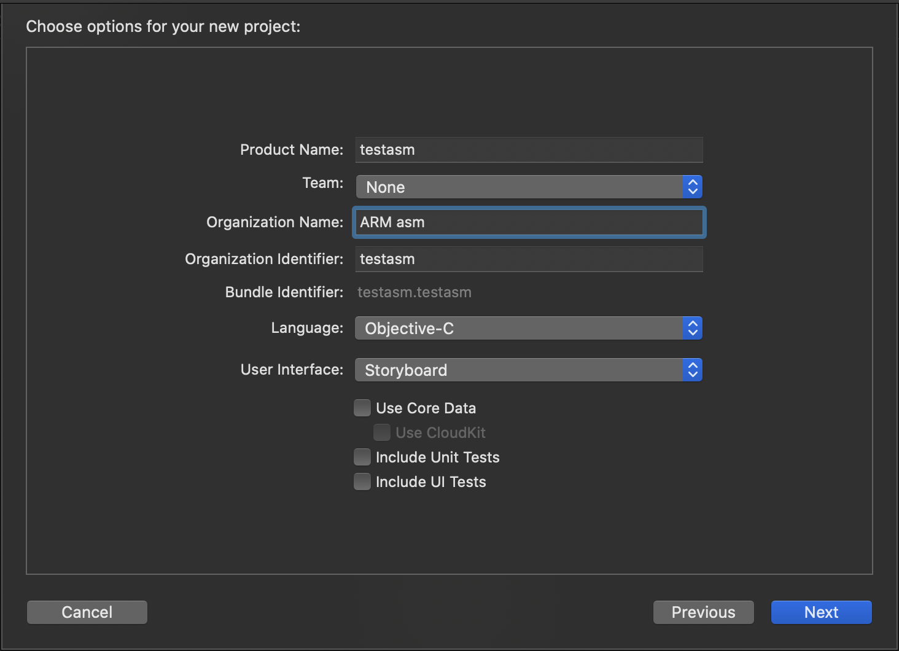

# iOS

## :a: Running under iOS

- [x] Create a project using the below setup.
- [x] Add a new `Assembly File` called `HelloWorld`
- [x] Add the `start` function in `ViewController.m` file

```objectivec
extern void start( void );

- (void)viewDidLoad {
    [super viewDidLoad];
    // Do any additional setup after loading the view.
    start();
}
```




## :x: I was able to run the iOS example only by using iOS Target 13.x which is not available for iPhone 5s and less


# References

https://developer.apple.com/documentation/xcode/writing_arm64_code_for_apple_platforms?language=objc

https://mikejfromva.com/2018/05/26/arm64-assembly-with-swift-and-xcode/

https://github.com/Siguza/ios-resources/blob/master/bits/arm64.md
